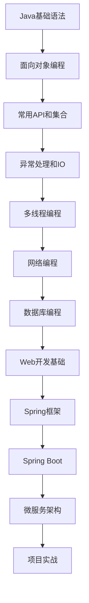

# Java学习路线图

## 学习阶段概览



## 第一阶段：Java基础 (4-6周)

### 学习内容
- [ ] **环境搭建** (1天)
  - [x] JDK安装配置
  - [x] IDE选择和配置
  - [x] 第一个Java程序

- [ ] **基础语法** (1周)
  - [ ] [变量和数据类型](../01-Java基础/01-语法基础/变量和数据类型.md)
  - [ ] [运算符](../01-Java基础/01-语法基础/运算符.md)
  - [ ] [控制结构](../01-Java基础/01-语法基础/控制结构.md)
  - [ ] [数组](../01-Java基础/01-语法基础/数组.md)

- [ ] **面向对象** (2-3周)
  - [ ] [类和对象](../01-Java基础/02-面向对象/类和对象.md)
  - [ ] [继承](../01-Java基础/02-面向对象/继承.md)
  - [ ] [多态](../01-Java基础/02-面向对象/多态.md)
  - [ ] [接口](../01-Java基础/02-面向对象/接口.md)
  - [ ] [抽象类](../01-Java基础/02-面向对象/抽象类.md)

### 实践项目
- [ ] 计算器程序
- [ ] 学生管理系统(控制台版)
- [ ] 图书管理系统(控制台版)

### 目标检验
- [ ] 能够独立编写简单的Java程序
- [ ] 理解面向对象的基本概念
- [ ] 掌握基本的程序调试技能

## 第二阶段：Java进阶 (6-8周)

### 学习内容
- [ ] **集合框架** (2周)
  - [ ] [ArrayList详解](../02-Java进阶/01-集合框架/ArrayList详解.md)
  - [ ] [LinkedList详解](../02-Java进阶/01-集合框架/LinkedList详解.md)
  - [ ] [HashMap详解](../02-Java进阶/01-集合框架/HashMap详解.md)
  - [ ] [Set集合](../02-Java进阶/01-集合框架/Set集合.md)

- [ ] **异常处理** (1周)
  - [ ] [异常体系](../02-Java进阶/02-异常处理/异常体系.md)
  - [ ] [异常处理最佳实践](../02-Java进阶/02-异常处理/异常处理最佳实践.md)

- [ ] **IO流** (2周)
  - [ ] [File类和文件操作](../02-Java进阶/03-IO流/File类和文件操作.md)
  - [ ] [字节流和字符流](../02-Java进阶/03-IO流/字节流和字符流.md)
  - [ ] [序列化](../02-Java进阶/03-IO流/序列化.md)

- [ ] **多线程** (2-3周)
  - [ ] [线程基础](../02-Java进阶/04-多线程/线程基础.md)
  - [ ] [同步机制](../02-Java进阶/04-多线程/同步机制.md)
  - [ ] [线程池](../02-Java进阶/04-多线程/线程池.md)

### 实践项目
- [ ] 文件管理工具
- [ ] 多线程下载器
- [ ] 聊天室程序(网络编程)

### 目标检验
- [ ] 熟练使用Java集合框架
- [ ] 能够处理文件IO操作
- [ ] 理解多线程编程概念

## 第三阶段：数据库和Web开发 (6-8周)

### 学习内容
- [ ] **数据库基础** (2周)
  - [ ] [SQL基础语法](../02-Java进阶/05-数据库/SQL基础语法.md)
  - [ ] [JDBC编程](../02-Java进阶/05-数据库/JDBC编程.md)
  - [ ] [连接池](../02-Java进阶/05-数据库/连接池.md)

- [ ] **Web开发基础** (2周)
  - [ ] [Servlet入门](../02-Java进阶/06-Web开发/Servlet入门.md)
  - [ ] [JSP开发](../02-Java进阶/06-Web开发/JSP开发.md)
  - [ ] [HTTP协议](../02-Java进阶/06-Web开发/HTTP协议.md)

- [ ] **前端基础** (2周)
  - [ ] HTML/CSS基础
  - [ ] JavaScript基础
  - [ ] Ajax异步请求

### 实践项目
- [ ] 员工管理系统(Web版)
- [ ] 在线投票系统
- [ ] 个人博客系统

### 目标检验
- [ ] 能够进行数据库操作
- [ ] 掌握基本的Web开发技能
- [ ] 理解前后端交互原理

## 第四阶段：框架技术 (8-10周)

### 学习内容
- [ ] **Spring框架** (4周)
  - [ ] [Spring核心概念](../03-框架技术/01-Spring/Spring核心概念.md)
  - [ ] [Spring MVC](../03-框架技术/01-Spring/SpringMVC详解.md)
  - [ ] [Spring Boot](../03-框架技术/01-Spring/SpringBoot快速入门.md)
  - [ ] [Spring Data JPA](../03-框架技术/01-Spring/SpringDataJPA.md)

- [ ] **ORM框架** (2周)
  - [ ] [MyBatis基础](../03-框架技术/02-ORM/MyBatis基础.md)
  - [ ] [MyBatis Plus](../03-框架技术/02-ORM/MyBatisPlus.md)

- [ ] **其他技术** (2-4周)
  - [ ] [Redis缓存](../03-框架技术/03-缓存/Redis基础.md)
  - [ ] [消息队列](../03-框架技术/04-消息队列/RabbitMQ入门.md)
  - [ ] [定时任务](../03-框架技术/05-定时任务/Quartz详解.md)

### 实践项目
- [ ] 电商系统后台
- [ ] RESTful API开发
- [ ] 权限管理系统

### 目标检验
- [ ] 熟练使用Spring生态
- [ ] 能够开发完整的Web应用
- [ ] 理解企业级开发规范

## 第五阶段：高级特性和微服务 (6-8周)

### 学习内容
- [ ] **JVM深入** (2周)
  - [ ] [JVM内存模型](../04-高级特性/01-JVM/JVM内存模型.md)
  - [ ] [垃圾回收](../04-高级特性/01-JVM/垃圾回收.md)
  - [ ] [性能调优](../04-高级特性/01-JVM/性能调优.md)

- [ ] **设计模式** (2周)
  - [ ] [常用设计模式](../04-高级特性/02-设计模式/常用设计模式.md)
  - [ ] [设计原则](../04-高级特性/02-设计模式/设计原则.md)

- [ ] **微服务架构** (4周)
  - [ ] [Spring Cloud](../04-高级特性/03-微服务/SpringCloud入门.md)
  - [ ] [Docker容器化](../04-高级特性/04-容器化/Docker基础.md)
  - [ ] [Kubernetes入门](../04-高级特性/04-容器化/Kubernetes入门.md)

### 实践项目
- [ ] 微服务电商平台
- [ ] 分布式系统设计
- [ ] 系统性能优化

### 目标检验
- [ ] 理解JVM工作原理
- [ ] 掌握常用设计模式
- [ ] 能够设计微服务架构

## 学习进度跟踪

### 每日学习记录
| 日期 | 学习内容 | 学习时长 | 完成度 | 备注 |
|------|----------|----------|--------|------|
| 2024-01-01 | Java环境搭建 | 2小时 | 100% | 完成JDK安装 |
| 2024-01-02 | 变量和数据类型 | 3小时 | 80% | 需要练习类型转换 |
| ... | ... | ... | ... | ... |

### 每周总结模板
```markdown
## 第X周学习总结 (YYYY-MM-DD ~ YYYY-MM-DD)

### 本周目标
- [ ] 目标1
- [ ] 目标2
- [ ] 目标3

### 实际完成
- [x] 完成项1
- [x] 完成项2
- [ ] 未完成项

### 学习心得
<!-- 记录本周的学习心得和感悟 -->

### 遇到的问题
1. 问题描述
   - 解决方案：xxx

### 下周计划
- [ ] 计划1
- [ ] 计划2
- [ ] 计划3
```

### 月度回顾模板
```markdown
## YYYY年MM月学习回顾

### 本月成就
- 掌握的技能：
- 完成的项目：
- 解决的难题：

### 技能评估
| 技能 | 熟练度 | 说明 |
|------|--------|------|
| Java基础 | ⭐⭐⭐⭐ | 基本掌握 |
| Spring | ⭐⭐⭐ | 正在学习 |
| ... | ... | ... |

### 下月目标
- [ ] 目标1
- [ ] 目标2
- [ ] 目标3
```

## 学习建议

### 学习方法
1. **理论与实践结合**: 每学一个概念就要写代码验证
2. **项目驱动学习**: 通过实际项目巩固知识点
3. **定期复习**: 建立知识体系，定期回顾
4. **参与社区**: 加入技术社区，与他人交流

### 时间规划
- **工作日**: 每天1-2小时
- **周末**: 每天3-4小时
- **总计**: 每周10-12小时

### 评估标准
- ⭐ 了解概念
- ⭐⭐ 能够使用
- ⭐⭐⭐ 熟练掌握
- ⭐⭐⭐⭐ 深入理解
- ⭐⭐⭐⭐⭐ 融会贯通

---
**创建日期**: 2024-01-XX
**最后更新**: 2024-01-XX
**预计完成**: 2024-XX-XX