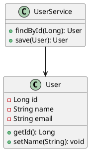

# IntelliJ IDEA 插件配置详解

## 🔧 必装插件清单

### 1. 代码质量类
#### SonarLint
**功能**: 实时代码质量检查
**配置**:
```
Settings -> Tools -> SonarLint
- 启用自动分析
- 连接SonarQube服务器(可选)
- 配置规则集
```

#### Alibaba Java Coding Guidelines
**功能**: 阿里巴巴Java开发规约检查
**使用**:
- 右键 -> 编码规约扫描
- 实时提示编码问题
- 自动修复建议

#### CheckStyle-IDEA
**功能**: Java代码风格检查
**配置**:
```
Settings -> Tools -> Checkstyle
- 添加配置文件: Google Style, Sun Style等
- 设置检查级别
- 配置自动检查
```

### 2. 开发效率类
#### Lombok Plugin
**功能**: 简化Java代码
**使用示例**:
```java
@Data
@AllArgsConstructor
@NoArgsConstructor
@Builder
public class User {
    private Long id;
    private String name;
    private String email;
}
```

#### String Manipulation
**功能**: 字符串处理工具
**快捷键**:
- `Alt + M`: 打开操作菜单
- 支持驼峰转换、编码解码等

#### Rainbow Brackets
**功能**: 彩虹括号，便于识别匹配
**配置**:
```
Settings -> Editor -> Color Scheme -> Rainbow Brackets
- 自定义颜色
- 设置高亮级别
```

#### CodeGlance Pro
**功能**: 代码缩略图
**配置**:
```
Settings -> Other Settings -> CodeGlance Pro
- 调整缩略图大小
- 设置显示位置
```

### 3. Git工具类
#### GitToolBox
**功能**: Git增强工具
**特性**:
- 行级别的Git blame
- 提交信息模板
- 分支状态显示

#### Git Flow Integration
**功能**: Git Flow工作流支持
**使用**:
- VCS -> Git Flow -> Initialize
- 支持feature/release/hotfix分支管理

### 4. 框架支持类
#### Spring Boot Helper
**功能**: Spring Boot开发助手
**特性**:
- 自动补全配置属性
- 快速生成Controller/Service
- 依赖分析

#### MyBatisX
**功能**: MyBatis增强插件
**特性**:
- XML和Interface互相跳转
- 生成CRUD代码
- SQL日志分析

**配置示例**:
```java
// Mapper接口
public interface UserMapper {
    @Select("SELECT * FROM user WHERE id = #{id}")
    User findById(Long id);
}

// 对应XML (插件可自动生成)
<select id="findById" resultType="User">
    SELECT * FROM user WHERE id = #{id}
</select>
```

### 5. 数据库工具类
#### Database Navigator
**功能**: 数据库连接和管理
**配置**:
```
Settings -> Database Navigator
- 配置数据源连接
- 设置SQL方言
- 自定义格式化规则
```

#### JPA Buddy
**功能**: JPA开发助手
**特性**:
- 实体类生成
- Repository自动完成
- 数据库迁移

### 6. 接口测试类
#### RestfulTool
**功能**: REST API测试工具
**使用**:
- 扫描Controller自动生成API列表
- 直接在IDE中测试接口
- 支持参数模板

#### HTTP Client
**功能**: IDEA内置HTTP客户端
**使用示例**:
```http
### 获取用户信息
GET http://localhost:8080/api/users/1
Accept: application/json

### 创建用户
POST http://localhost:8080/api/users
Content-Type: application/json

{
  "name": "张三",
  "email": "zhangsan@example.com"
}
```

### 7. 文档工具类
#### Swagger
**功能**: API文档生成
**集成**:
```java
@RestController
@Api(tags = "用户管理")
public class UserController {
    
    @GetMapping("/{id}")
    @ApiOperation("根据ID查询用户")
    public User getUser(@PathVariable Long id) {
        return userService.findById(id);
    }
}
```

#### PlantUML Integration
**功能**: UML图表绘制
**示例**:


### 8. 性能分析类
#### JProfiler
**功能**: Java性能分析
**使用**:
- 内存分析
- CPU使用率分析
- 线程分析

#### VisualVM Launcher
**功能**: VisualVM集成
**配置**:
```
Settings -> Tools -> VisualVM Launcher
- 配置VisualVM路径
- 设置JVM参数
```

## 🎨 主题和外观插件

### Material Theme UI
**功能**: Material Design主题
**配置**:
```
Settings -> Appearance & Behavior -> Material Theme
- 选择主题色彩
- 自定义强调色
- 配置图标包
```

### Atom Material Icons
**功能**: 文件图标美化
**特性**:
- 丰富的文件类型图标
- 支持自定义颜色
- 文件夹图标主题

## ⚡ 快捷键配置

### 自定义快捷键
```
Settings -> Keymap

推荐快捷键设置:
- Ctrl + Shift + F12: 全屏编辑模式
- Ctrl + `: 打开终端
- Ctrl + Shift + A: 查找操作
- Ctrl + E: 最近文件
- Ctrl + Shift + E: 最近编辑位置
```

### 插件相关快捷键
```
SonarLint:
- Ctrl + Shift + S: 分析当前文件

String Manipulation:
- Alt + M: 字符串操作菜单

Translation:
- Ctrl + Shift + Y: 翻译选中文本

Rainbow Brackets:
- Ctrl + 鼠标右键: 高亮匹配括号
```

## 🔧 插件配置最佳实践

### 1. 性能优化
```
Settings -> Editor -> General
- 减少不必要的插件
- 关闭未使用的检查
- 优化索引设置
```

### 2. 团队协作
```
分享配置:
File -> Manage IDE Settings -> Export Settings
- 导出插件配置
- 团队成员导入统一配置
```

### 3. 插件管理
```
定期清理:
- 卸载不常用插件
- 更新插件到最新版本
- 检查插件兼容性
```

## 📝 插件使用技巧

### Lombok使用技巧
```java
// 1. 数据类
@Data
@Builder
public class User {
    private String name;
    private Integer age;
}

// 2. 日志注解
@Slf4j
public class UserService {
    public void doSomething() {
        log.info("执行某个操作");
    }
}

// 3. 异常处理
@SneakyThrows
public String readFile(String path) {
    return Files.readString(Paths.get(path));
}
```

### Git工具使用技巧
```
1. 查看提交历史:
   Git -> Show Git Log

2. 分支管理:
   Git -> Branches -> New Branch

3. 代码比较:
   Git -> Compare with Branch
```

### 代码生成技巧
```java
// 1. 使用Live Templates
输入 "psvm" + Tab -> 生成main方法
输入 "sout" + Tab -> 生成System.out.println

// 2. 自定义模板
Settings -> Editor -> Live Templates
创建自定义代码模板
```

## 🐛 常见问题解决

### 插件冲突
**问题**: 插件间相互冲突
**解决**: 
1. 禁用冲突插件
2. 查看插件兼容性
3. 升级到兼容版本

### 性能问题
**问题**: IDE运行缓慢
**解决**:
1. 增加堆内存大小
2. 禁用不必要的插件
3. 清理缓存和索引

### 插件失效
**问题**: 插件功能异常
**解决**:
1. 重启IDE
2. 重新安装插件
3. 检查插件版本兼容性

---
**创建日期**: 2024-01-XX
**最后更新**: 2024-01-XX
**适用版本**: IntelliJ IDEA 2023.x